# 🔧 Mantenimiento Predictivo con Sensores IoT

<h2 align="center">Modelos Supervisados de Clasificación y Regresión</h2>

<p align="center">
  
  
  
  
</p>

> **Curso:** Aprendizaje Automático  
> **Dataset:** AI4I 2020 Predictive Maintenance Dataset  
> **Dominio:** Industria 4.0 · Sensores IoT · Mantenimiento predictivo  
> **Repositorio:** Proyecto-S2

---

<h2 id="tabla-de-contenido">📑 Tabla de contenido</h2>

<ol>
  <li><a href="#resumen">📌 Resumen</a></li>
  <li><a href="#cumplimiento-de-la-actividad">✅ Cumplimiento de la actividad</a></li>
  <li><a href="#dataset-y-dominio-del-problema">📊 Dataset y dominio del problema</a></li>
  <li><a href="#problemas-abordados">🎯 Problemas abordados</a>
    <ul>
      <li><a href="#clasificacion">Clasificación</a></li>
      <li><a href="#regresion">Regresión</a></li>
    </ul>
  </li>
  <li><a href="#metodologia">⚙️ Metodología</a>
    <ul>
      <li><a href="#eda">1. Análisis exploratorio de datos</a></li>
      <li><a href="#preprocesamiento">2. Preprocesamiento</a></li>
      <li><a href="#modelado">3. Modelado</a>
        <ul>
          <li><a href="#ajuste-parametro-c-svm">Ajuste del parámetro C en SVM</a></li>
        </ul>
      </li>
      <li><a href="#evaluacion-experimental">4. Evaluación experimental</a></li>
    </ul>
  </li>
  <li><a href="#variables-utilizadas">📌 Variables utilizadas</a></li>
  <li><a href="#metricas-de-evaluacion">📈 Métricas de evaluación</a></li>
  <li><a href="#resultados-principales">📊 Resultados principales</a>
    <ul>
      <li><a href="#resultados-de-clasificacion">Resultados de clasificación</a></li>
      <li><a href="#matrices-de-confusion">Matrices de confusión</a></li>
      <li><a href="#curvas-roc">Curvas ROC</a></li>
      <li><a href="#validacion-cruzada">Validación cruzada</a></li>
      <li><a href="#resultados-de-regresion">Resultados de regresión</a></li>
      <li><a href="#deteccion-de-overfitting">Detección de overfitting</a></li>
    </ul>
  </li>
  <li><a href="#hallazgos-principales">🔍 Hallazgos principales</a></li>
  <li><a href="#conclusiones-tecnicas">🧠 Conclusiones técnicas</a></li>
  <li><a href="#estructura-del-repositorio">📁 Estructura del repositorio</a></li>
  <li><a href="#tecnologias-y-librerias-utilizadas">🛠 Tecnologías y librerías utilizadas</a></li>
  <li><a href="#como-ejecutar-el-proyecto">🚀 Cómo ejecutar el proyecto</a></li>
  <li><a href="#recomendaciones-de-mejora-futura">📌 Recomendaciones de mejora futura</a></li>
  <li><a href="#equipo">👥 Equipo</a></li>
</ol>

---

<h2 id="resumen">📌 Resumen</h2>

Este proyecto implementa modelos supervisados de Machine Learning para un caso técnico de **mantenimiento predictivo industrial**. A partir de sensores IoT, se busca detectar patrones asociados a fallos de máquina y analizar la capacidad de los datos para estimar el desgaste de una herramienta.

El trabajo incluye análisis exploratorio, preprocesamiento, entrenamiento de modelos, comparación experimental, validación cruzada y conclusiones técnicas orientadas al contexto industrial.

<p align="center">
  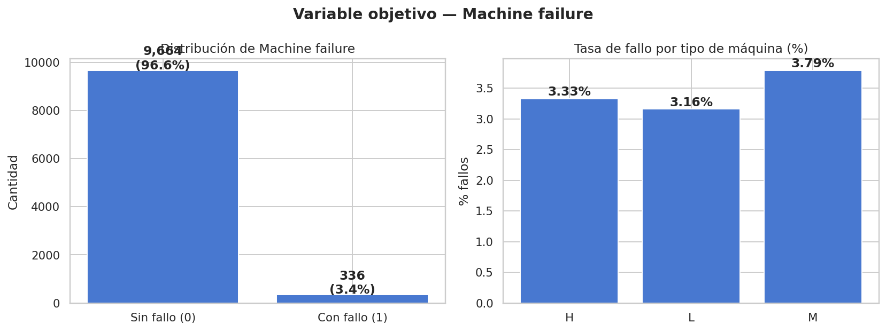
</p>

<p align="right"><a href="#tabla-de-contenido">⬆ Volver a la tabla de contenido</a></p>

---

<h2 id="cumplimiento-de-la-actividad">✅ Cumplimiento de la actividad</h2>

| Requisito solicitado | Estado | Evidencia en el proyecto |
|---|---:|---|
| Repositorio colaborativo | ✅ Cumple | Proyecto alojado en GitHub |
| Dataset técnico | ✅ Cumple | AI4I Predictive Maintenance Dataset |
| Análisis exploratorio de datos | ✅ Cumple | Histogramas, boxplots, matriz de correlación y scatter plots |
| Preprocesamiento justificado | ✅ Cumple | Encoding, imputación, escalado y split 80/20 |
| Al menos dos clasificadores | ✅ Cumple | Árbol, SVM y Random Forest |
| Comparación experimental | ✅ Cumple | Tabla resumen, barplot, heatmap y ROC |
| Métricas obligatorias | ✅ Cumple | Precision, Recall, F1-score y matriz de confusión |
| Documentación técnica | ✅ Cumple | README + notebook documentado |
| Conclusiones técnicas | ✅ Cumple | Interpretación de resultados y recomendaciones |

<p align="right"><a href="#tabla-de-contenido">⬆ Volver a la tabla de contenido</a></p>

---

<h2 id="dataset-y-dominio-del-problema">📊 Dataset y dominio del problema</h2>

El dataset utilizado corresponde a un escenario industrial donde sensores IoT registran variables operativas de máquinas. Este tipo de datos es común en sistemas de **Industria 4.0**, donde el objetivo es anticipar fallos antes de que generen paradas no planificadas.

| Característica | Detalle |
|---|---|
| Dataset | AI4I 2020 Predictive Maintenance Dataset |
| Registros | 10,000 |
| Dominio | Sensores industriales IoT |
| Target clasificación | `Machine failure` |
| Target regresión | `Tool wear [min]` |
| Desbalance de clases | Aproximadamente 3.4% de fallos |
| Valores nulos | No se identificaron valores nulos |

<h3>Variables principales</h3>

| Variable | Tipo | Descripción |
|---|---|---|
| `Type` | Categórica | Calidad/tipo de máquina: L, M, H |
| `Air temperature [K]` | Numérica | Temperatura ambiente |
| `Process temperature [K]` | Numérica | Temperatura del proceso |
| `Rotational speed [rpm]` | Numérica | Velocidad de rotación |
| `Torque [Nm]` | Numérica | Par de torsión |
| `Tool wear [min]` | Numérica | Desgaste acumulado de herramienta |
| `Machine failure` | Binaria | Fallo de máquina: 0 = No, 1 = Sí |

<p align="center">
  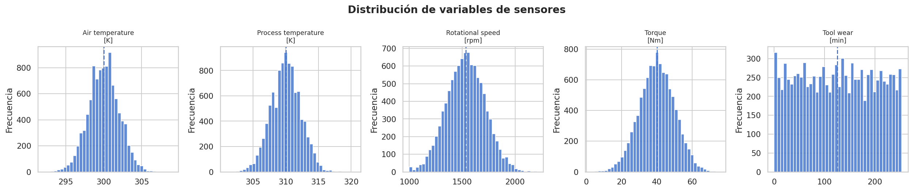
</p>

<p align="right"><a href="#tabla-de-contenido">⬆ Volver a la tabla de contenido</a></p>

---

<h2 id="problemas-abordados">🎯 Problemas abordados</h2>

<h3 id="clasificacion">Clasificación</h3>

**Pregunta técnica:** ¿Fallará la máquina?

| Elemento | Descripción |
|---|---|
| Tipo de problema | Clasificación binaria |
| Variable objetivo | `Machine failure` |
| Clases | 0 = Sin fallo, 1 = Con fallo |
| Prioridad técnica | Detectar la mayor cantidad posible de fallos reales |

<h3 id="regresion">Regresión</h3>

**Pregunta técnica:** ¿Cuánto se ha desgastado la herramienta?

| Elemento | Descripción |
|---|---|
| Tipo de problema | Regresión |
| Variable objetivo | `Tool wear [min]` |
| Unidad | Minutos de desgaste acumulado |
| Prioridad técnica | Estimar desgaste para mantenimiento preventivo |

<p align="right"><a href="#tabla-de-contenido">⬆ Volver a la tabla de contenido</a></p>

---

<h2 id="metodologia">⚙️ Metodología</h2>

<h3 id="eda">1. Análisis exploratorio de datos</h3>

El EDA permitió revisar la distribución de variables, detectar desbalance de clases, observar relaciones entre sensores e identificar posibles señales predictivas.

Se generaron las siguientes visualizaciones:

- Distribución de la variable objetivo.
- Histogramas de sensores.
- Boxplots por estado de fallo.
- Matriz de correlación.
- Scatter plots entre sensores.

<p align="center">
  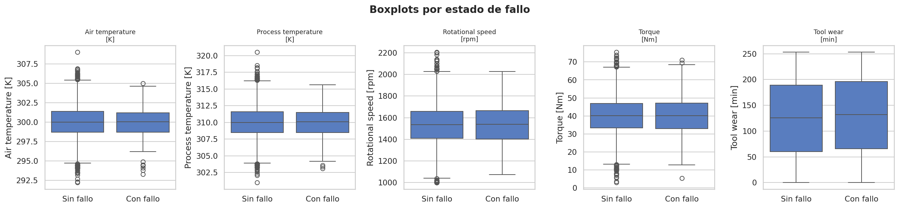
</p>

<p align="center">
  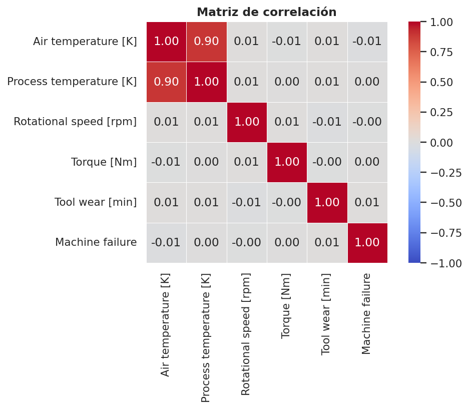
</p>

<p align="center">
  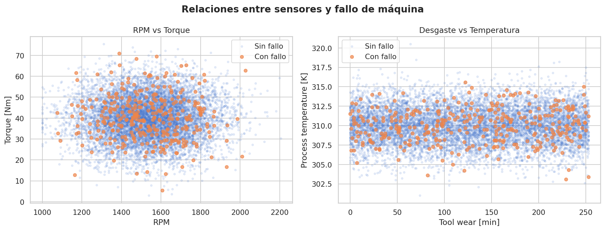
</p>

<h3 id="preprocesamiento">2. Preprocesamiento</h3>

| Paso | Decisión aplicada | Justificación |
|---|---|---|
| Codificación de `Type` | L=0, M=1, H=2 | Representa orden de calidad/tipo |
| Eliminación de `UDI` | No se usa como predictor | Es un identificador |
| Imputación | Mediana | Robusta ante posibles valores extremos |
| Escalado | `StandardScaler` | Necesario para SVM y variables en distintas escalas |
| División | 80/20 | Separación train/test |
| Estratificación | `stratify=y` | Mantiene proporción de fallos |

> ⚠️ El scaler y el imputer se ajustan únicamente con el conjunto de entrenamiento para evitar **data leakage**.

<h3 id="modelado">3. Modelado</h3>

<h4>Modelos de clasificación</h4>

| Modelo | Justificación |
|---|---|
| Árbol de Decisión | Interpretable, basado en reglas de decisión |
| SVM RBF | Captura relaciones no lineales entre sensores |
| Random Forest | Reduce varianza y permite importancia de variables |


<h4 id="ajuste-parametro-c-svm">Ajuste del parámetro C en SVM</h4>

El modelo SVM con kernel RBF requiere ajustar el hiperparámetro <b>C</b>, el cual controla el equilibrio entre el margen de separación y los errores de clasificación. Debido al fuerte desbalance de clases del dataset, el criterio de selección utilizado fue el <b>F1-score</b>, ya que permite equilibrar Precision y Recall.

<table>
  <tr>
    <th>C</th>
    <th>Interpretación</th>
    <th>Riesgo</th>
  </tr>
  <tr>
    <td>0.1</td>
    <td>Margen amplio, mayor tolerancia a errores</td>
    <td>Underfitting</td>
  </tr>
  <tr>
    <td>1.0</td>
    <td>Balance estándar entre margen y errores</td>
    <td>Valor de referencia</td>
  </tr>
  <tr>
    <td>10.0</td>
    <td>Margen más estrecho, mayor ajuste a los datos</td>
    <td>Posible overfitting</td>
  </tr>
</table>

Se evaluaron los valores <b>C = 0.1</b>, <b>C = 1.0</b> y <b>C = 10.0</b>. El mejor resultado se obtuvo con <b>C = 0.1</b>, alcanzando un <b>F1-score de 0.0757</b> y un <b>Recall de 0.5075</b>. Este resultado es relevante en mantenimiento predictivo porque permite detectar más fallos reales, reduciendo el riesgo de falsos negativos en un entorno industrial.


<h4>Modelos de regresión</h4>

| Modelo | Justificación |
|---|---|
| Regresión Lineal | Baseline simple |
| Ridge | Regularización L2 |
| Árbol de Regresión | Captura relaciones no lineales |
| Random Forest Regressor | Ensamble robusto para regresión |

<h3 id="evaluacion-experimental">4. Evaluación experimental</h3>

La evaluación se realizó con métricas apropiadas para clasificación desbalanceada y regresión:

- Matriz de confusión.
- Precision.
- Recall.
- F1-score.
- AUC-ROC.
- MAE, RMSE y R² para regresión.
- Validación cruzada estratificada 5-Fold.

<p align="right"><a href="#tabla-de-contenido">⬆ Volver a la tabla de contenido</a></p>

---

<h2 id="variables-utilizadas">📌 Variables utilizadas</h2>

<h3>Problema A — Clasificación</h3>

```python
features_clf = [
    'Type_encoded',
    'Air temperature [K]',
    'Process temperature [K]',
    'Rotational speed [rpm]',
    'Torque [Nm]',
    'Tool wear [min]'
]

target_clf = 'Machine failure'
```

<h3>Problema B — Regresión</h3>

```python
features_reg = [
    'Type_encoded',
    'Air temperature [K]',
    'Process temperature [K]',
    'Rotational speed [rpm]',
    'Torque [Nm]'
]

target_reg = 'Tool wear [min]'
```

> Para regresión se excluye `Machine failure`, ya que en producción real no se conocería antes de hacer la predicción.

<p align="right"><a href="#tabla-de-contenido">⬆ Volver a la tabla de contenido</a></p>

---

<h2 id="metricas-de-evaluacion">📈 Métricas de evaluación</h2>

| Métrica | Interpretación | Uso en este proyecto |
|---|---|---|
| Accuracy | Proporción total de aciertos | Métrica secundaria por desbalance |
| Precision | Qué tan confiables son las predicciones positivas | Control de falsas alarmas |
| Recall | Qué proporción de fallos reales se detecta | Métrica crítica industrial |
| F1-score | Balance entre precision y recall | Métrica principal de clasificación |
| AUC-ROC | Capacidad discriminativa global | Comparación adicional |
| MAE | Error promedio absoluto | Regresión |
| RMSE | Penaliza errores grandes | Regresión |
| R² | Varianza explicada | Regresión |

> En un contexto industrial, un falso negativo representa un fallo no detectado. Por eso el **Recall** tiene alto valor práctico.

<p align="right"><a href="#tabla-de-contenido">⬆ Volver a la tabla de contenido</a></p>

---

<h2 id="resultados-principales">📊 Resultados principales</h2>

<h3 id="resultados-de-clasificacion">Resultados de clasificación</h3>

| Modelo | Accuracy | Precision | Recall | F1 | AUC | Hiperparámetro destacado |
|:--|--:|--:|--:|--:|--:|:--|
| Árbol de Decisión | 0.8885 | 0.0244 | 0.0597 | 0.0346 | 0.5018 | max_depth=8 |
| SVM RBF | 0.5850 | 0.0409 | 0.5075 | **0.0757** | 0.4415 | **C=0.1** |
| Random Forest | 0.9555 | 0.0769 | 0.0299 | 0.0430 | 0.5273 | n_estimators=200 |

**Mejor F1-score:** SVM RBF  
**Mejor Recall:** SVM RBF  
**Mejor AUC-ROC:** Random Forest

<p align="center">
  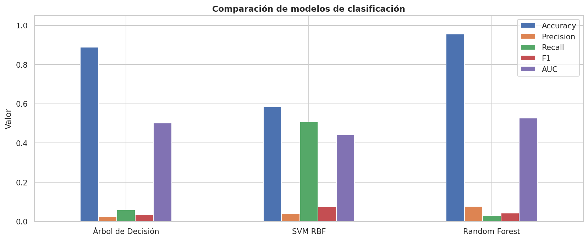
</p>

<p align="center">
  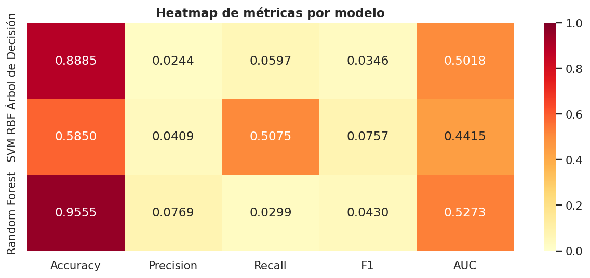
</p>

<h3 id="matrices-de-confusion">Matrices de confusión</h3>

Las matrices de confusión permiten observar falsos positivos, falsos negativos, verdaderos positivos y verdaderos negativos.

<p align="center">
  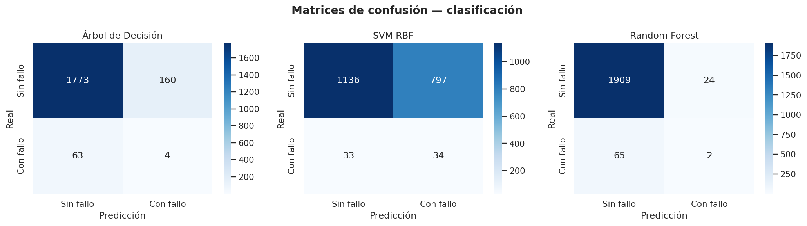
</p>

<h3 id="curvas-roc">Curvas ROC</h3>

La curva ROC compara la capacidad discriminativa de los modelos frente a una línea base aleatoria.

<p align="center">
  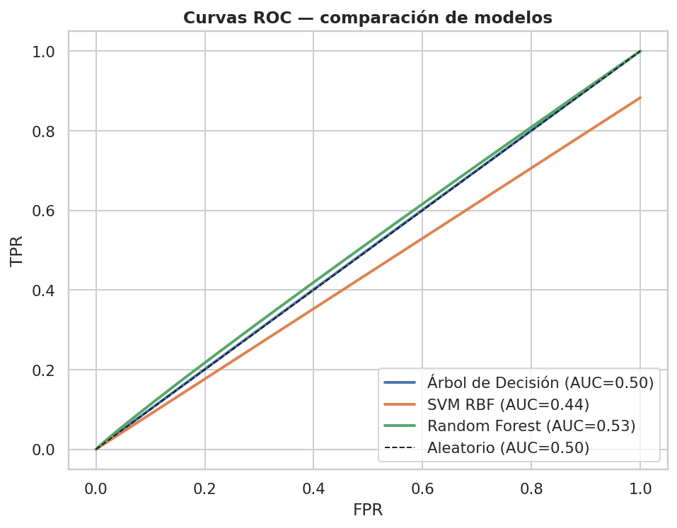
</p>

<h3 id="validacion-cruzada">Validación cruzada</h3>

|                   |   Media |    Std |    Min |    Max |
|:------------------|--------:|-------:|-------:|-------:|
| Árbol de Decisión |  0.0629 | 0.0077 | 0.0538 | 0.0758 |
| SVM RBF           |  0.05   | 0.0068 | 0.0397 | 0.0601 |
| Random Forest     |  0.0111 | 0.0222 | 0      | 0.0556 |

<p align="center">
  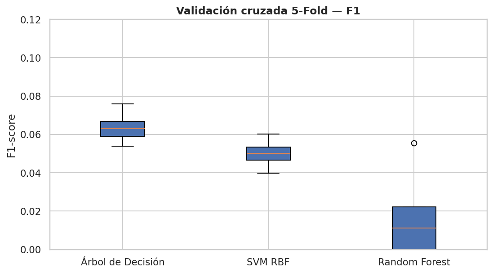
</p>

<h3 id="resultados-de-regresion">Resultados de regresión</h3>

|                         |     MAE |    RMSE |      R2 |
|:------------------------|--------:|--------:|--------:|
| Regresión Lineal        | 63.8206 | 73.7113 | -0.0002 |
| Ridge α=10              | 63.8206 | 73.7113 | -0.0002 |
| Decision Tree Regressor | 64.5988 | 75.0782 | -0.0376 |
| Random Forest Regressor | 64.1545 | 74.3666 | -0.0181 |

<p align="center">
  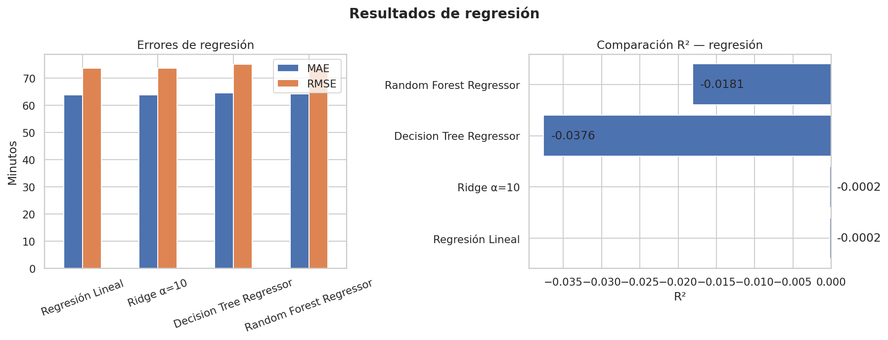
</p>

<h3>Importancia de variables</h3>

Random Forest permite revisar qué variables tuvieron mayor peso relativo en las decisiones del modelo.

<p align="center">
  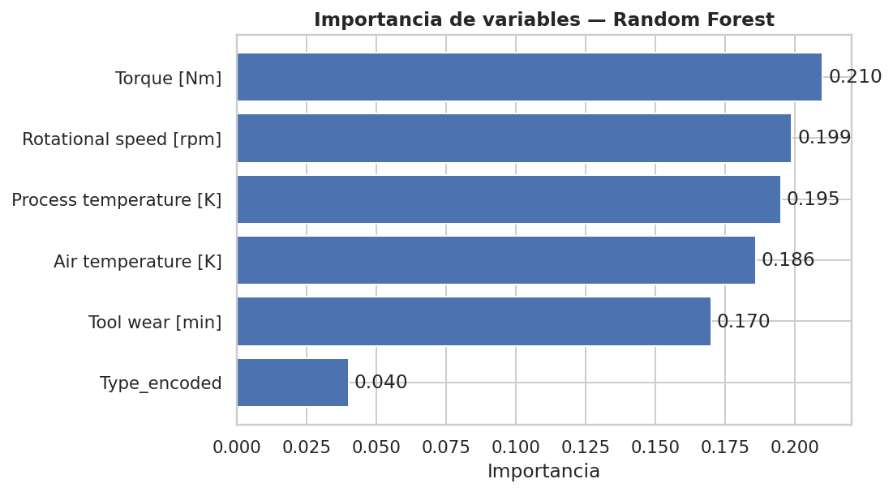
</p>

<h3 id="deteccion-de-overfitting">Detección de overfitting</h3>

Se revisó la diferencia entre desempeño en entrenamiento y prueba. En el caso del Árbol de Decisión, al aumentar la profundidad, el modelo tiende a memorizar patrones del conjunto de entrenamiento, por lo que se limitó la profundidad y se usó validación cruzada.

<p align="right"><a href="#tabla-de-contenido">⬆ Volver a la tabla de contenido</a></p>

---

<h2 id="hallazgos-principales">🔍 Hallazgos principales</h2>

1. El dataset está fuertemente desbalanceado: solo alrededor del 3.4% de los registros corresponden a fallos.
2. La accuracy puede ser engañosa, porque un modelo podría acertar muchos casos simplemente prediciendo “sin fallo”.
3. El SVM RBF logra el mejor comportamiento para detectar fallos reales debido a su mayor Recall.
4. Random Forest obtiene la mejor accuracy y AUC-ROC, pero detecta pocos fallos reales.
5. Los modelos de regresión presentan R² negativo, indicando que las variables disponibles no explican suficientemente el desgaste acumulado.
6. No se identifican señales de data leakage, ya que no existen métricas artificialmente perfectas.

<p align="right"><a href="#tabla-de-contenido">⬆ Volver a la tabla de contenido</a></p>

---

<h2 id="conclusiones-tecnicas">🧠 Conclusiones técnicas</h2>

El proyecto evidencia que el mantenimiento predictivo con sensores IoT es un problema técnicamente desafiante cuando la clase de fallo es minoritaria. Los valores bajos de F1-score no deben interpretarse como un error del proceso, sino como una consecuencia del desbalance y de la baja separación entre clases.

Para el problema de clasificación, el modelo recomendado es **SVM con kernel RBF**, ya que prioriza la detección de fallos reales. En un entorno industrial, detectar más fallos puede ser más importante que mantener una accuracy alta, debido al costo operativo de una parada no planificada.

El ajuste del parámetro <b>C</b> en el modelo SVM fue determinante para seleccionar la configuración con mejor equilibrio entre Precision y Recall. En este caso, <b>C=0.1</b> permitió obtener el mejor F1-score y reforzó la capacidad del modelo para detectar fallos reales.


Para el problema de regresión, los resultados sugieren que las variables actuales no son suficientes para predecir con precisión el desgaste acumulado. Sería necesario incorporar variables históricas, ventanas temporales o información del ciclo de uso de la máquina.

<p align="right"><a href="#tabla-de-contenido">⬆ Volver a la tabla de contenido</a></p>

---

<h2 id="estructura-del-repositorio">📁 Estructura del repositorio</h2>

```text
Proyecto-S2/
├── README.md
├── data/
│   └── ai4i_predictive_maintenance.csv
├── notebooks/
│   └── Taller_MantenimientoPredictivo_IoT.ipynb
└── assets/
    ├── 01_distribucion_target.png
    ├── 02_histogramas_sensores.png
    ├── 03_boxplots_fallo.png
    ├── 04_matriz_correlacion.png
    ├── 05_scatter_sensores_fallo.png
    ├── 06_matrices_confusion.png
    ├── 07_comparacion_metricas_clasificacion.png
    ├── 08_heatmap_metricas.png
    ├── 09_curvas_roc.png
    ├── 10_importancia_variables.png
    ├── 11_validacion_cruzada_f1.png
    └── 12_resultados_regresion.png
```

> La carpeta `assets/` contiene las figuras incrustadas en este README.

<p align="right"><a href="#tabla-de-contenido">⬆ Volver a la tabla de contenido</a></p>

---

<h2 id="tecnologias-y-librerias-utilizadas">🛠 Tecnologías y librerías utilizadas</h2>

| Herramienta | Uso |
|---|---|
| Python | Lenguaje principal |
| Pandas | Manipulación de datos |
| NumPy | Cálculo numérico |
| Matplotlib | Visualización |
| Seaborn | Gráficos estadísticos |
| Scikit-learn | Modelado y métricas |
| Google Colab / Jupyter | Ejecución del notebook |
| GitHub | Repositorio colaborativo |

<p align="right"><a href="#tabla-de-contenido">⬆ Volver a la tabla de contenido</a></p>

---

<h2 id="como-ejecutar-el-proyecto">🚀 Cómo ejecutar el proyecto</h2>

<h3>Opción local</h3>

```bash
git clone https://github.com/madhelinetorres-cyber/Proyecto-S2.git
cd Proyecto-S2
pip install pandas numpy matplotlib seaborn scikit-learn jupyter
jupyter notebook
```

<h3>Opción Google Colab</h3>

1. Subir el dataset a Google Drive.
2. Abrir el notebook en Google Colab.
3. Ajustar la ruta del archivo CSV.
4. Ejecutar todas las celdas.

```python
df = pd.read_csv('data/ai4i_predictive_maintenance.csv')
```

<p align="right"><a href="#tabla-de-contenido">⬆ Volver a la tabla de contenido</a></p>

---

<h2 id="recomendaciones-de-mejora-futura">📌 Recomendaciones de mejora futura</h2>

- Aplicar técnicas de balanceo como **SMOTE** o **ADASYN**.
- Ajustar hiperparámetros con **GridSearchCV** o **RandomizedSearchCV**.
- Probar modelos avanzados como **XGBoost** o **LightGBM**.
- Realizar ajuste de umbral para mejorar Recall.
- Incorporar variables temporales de historial de uso.
- Evaluar costos de falsos positivos y falsos negativos en contexto industrial.
- Exportar modelos entrenados con `joblib` para despliegue posterior.

<p align="right"><a href="#tabla-de-contenido">⬆ Volver a la tabla de contenido</a></p>

---

<h2 id="equipo">👥 Equipo</h2>

| Integrante | Rol sugerido |
|---|---|
| Madheline Katerine Torres Hallo | Desarrollo de modelos y documentación |
| Carlos Vladimir Ramírez Espinoza | EDA y visualizaciones |
| Dennys Francisco Salazar Domínguez | Interpretación técnica y README |

---

<p align="center">
  <b>Proyecto desarrollado para el curso de Aprendizaje Automático</b><br>
  Maestría en Inteligencia Artificial
</p>
